# Virtual Classroom

A web application where user can join or create classes.
And classes have Class Notes section where only the user who has created the class can post stuff.
In the Forum Section both the admin and the users who have joined that class can Post stuff.

The user who has created the class can block or unblock the students in that class from posting in the Forum.

### Development

- Clone Repository

```
git clone https://github.com/porush64/Virtual-Classroom.git
cd Virtual-Classroom
```

- Install Dependencies

```
npm install
```

- Set Up Firebase

```
All the login credentials for connecting the application to a database are already present in this file.

/src/lib/firebase.js
```

- Run (On Local Machine)

```
npm start
```

- Hosted Web App link

https://virtual-classroom-286fd.web.app/

OR

https://virtual-classroom-286fd.firebaseapp.com/


---

## Screenshots

Sign-In / Sign-Up Page

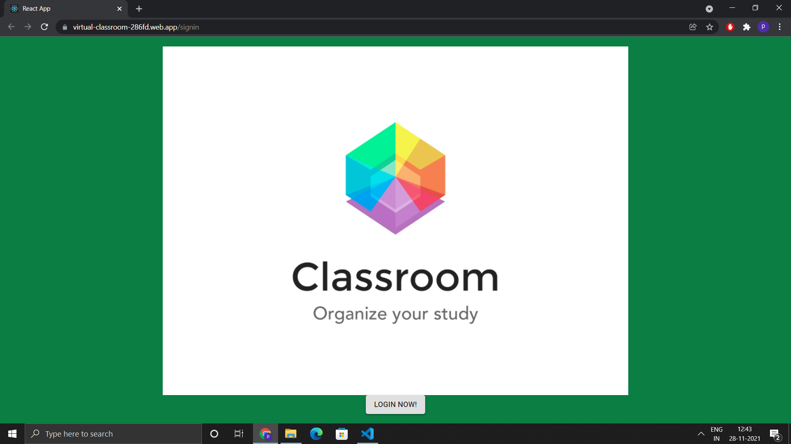

I have used Google Authenticator for Login.
So You can use any gmail account of yours to login into the web application.

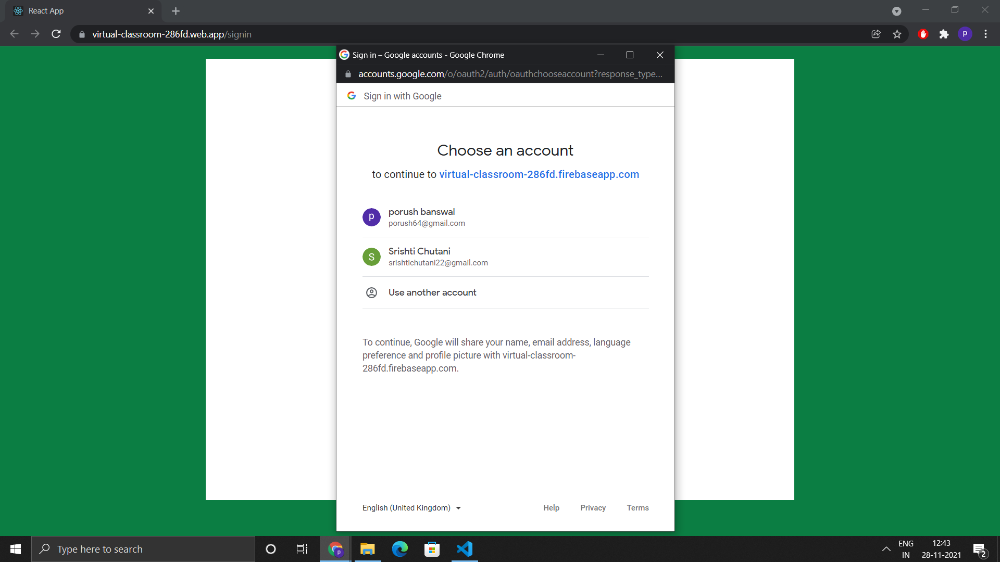

Main Page

Main page will have all the class that the Logged-In user has created and have Joined.
By clicking on the avatar (In the Top Right Corner), you can logout of the application.

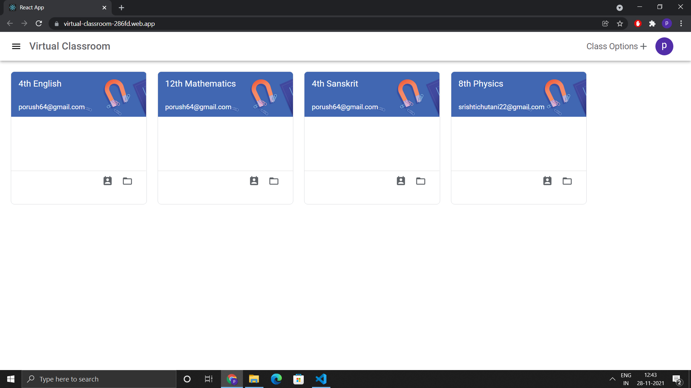

On the main page you will have two options

1. To Join Class
2. Create Class

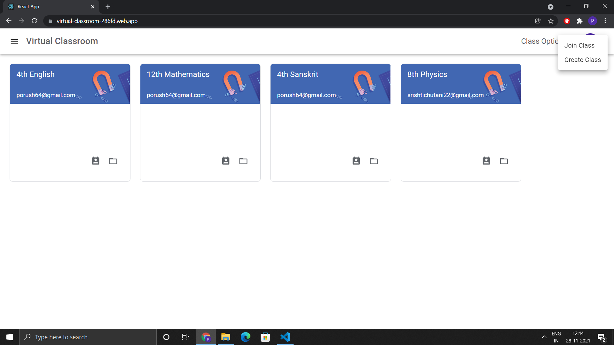

To Join Class You will need the classcode and the gmail id of the user who has created that class.
(The ClassCode can be find when you eneter in any class, On the top you will have the details of Class Code You can use this class code from some other account to join that class. If you enter wrong class code or wrong associated email id, you will have an error that No Class was found.)

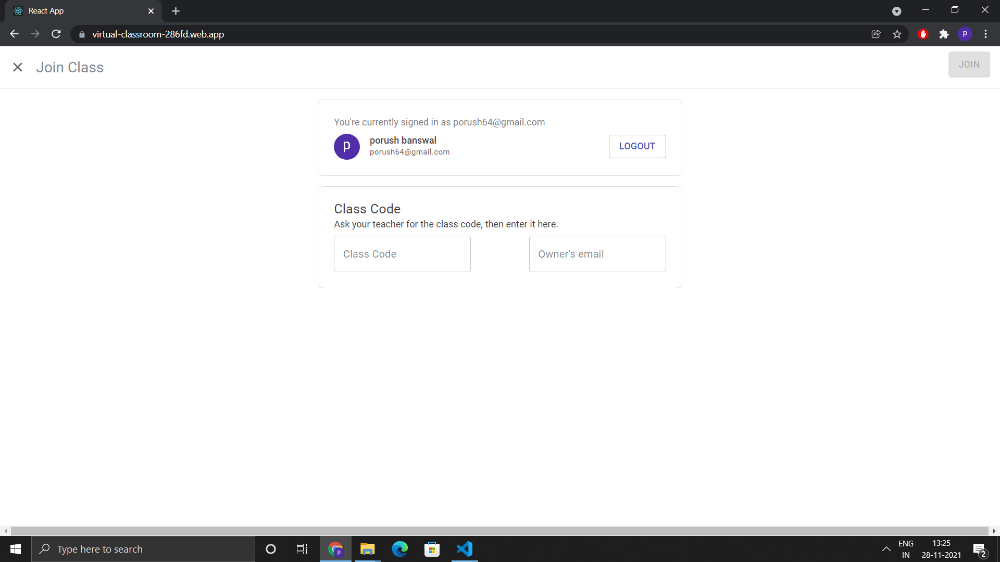

To Create Class first you need to check the checkbox and click on continue.

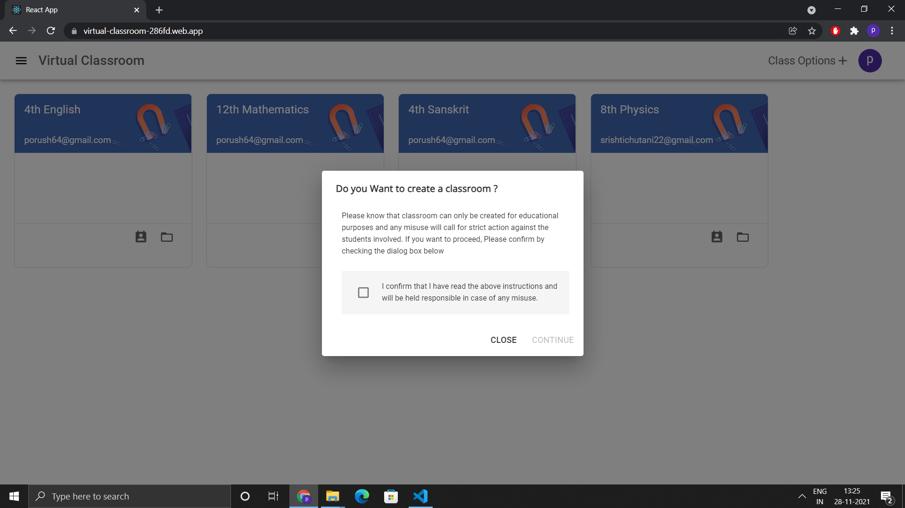

Then You need to enter the details, the Create button will remain disabled till you enter the class name.

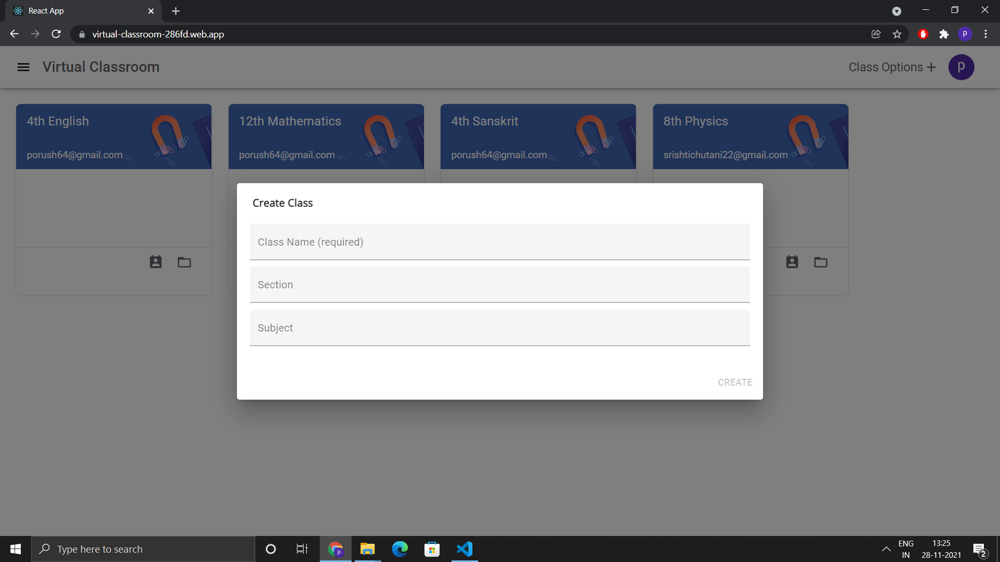

Class Room (Admin's View)

In Class Room you will have two views, Class Notes view and Forum view, Only the user who has created the class can post stuff in class notes view.
But in Forum view both the student and teacher can post stuff.

Only the teacher will be able to block or unblock any student from posting into the Forum.

Note: You can view the class code in these screenshots. Use this to join this class from some other account.

Class Notes View
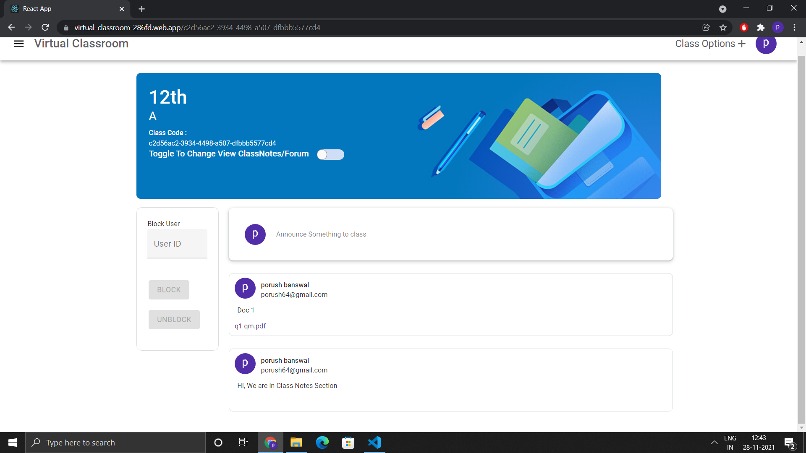

Forum View
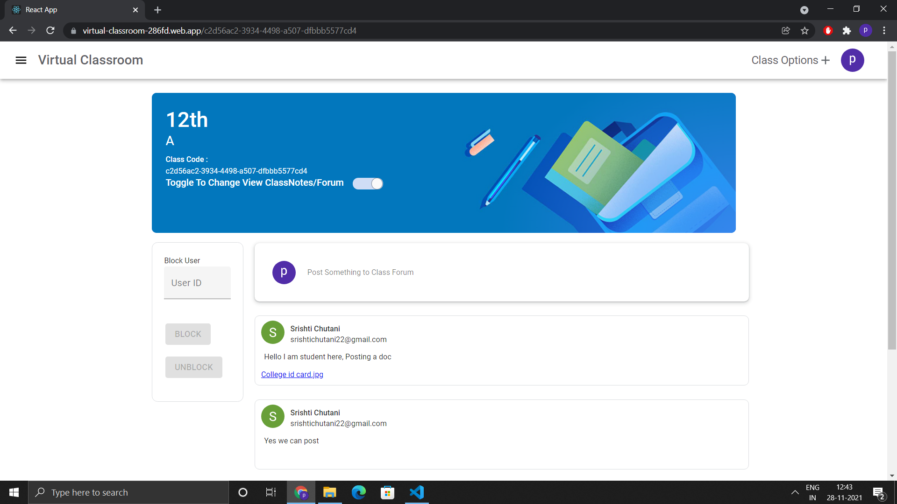

Class Room (Student's View)

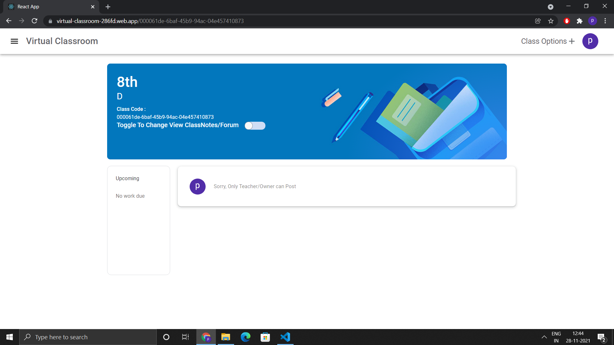

Posting in Class Notes/Forum

You need to type something or attach a file to enable the Post button.
There can not be empty post. (Note: Space " " count as some text).

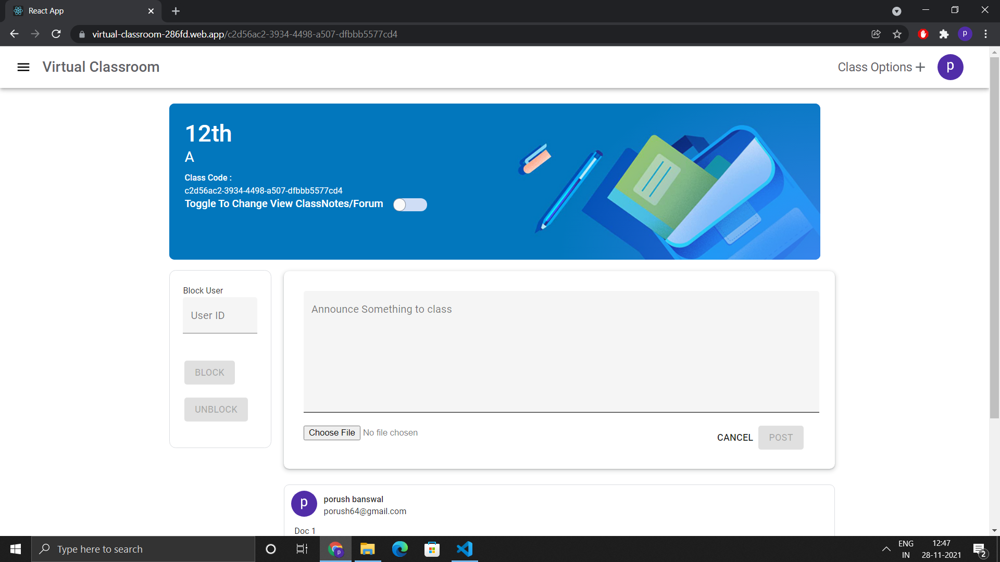

## Key Points

The user who is present in class can not block himself. (Note: No error will displayed on the website, Handled by not running the query on the backend.)
He can add users in the block list irrespective of the fact that those students are present inside the class or not.
If some block user joins the class, he won't be able to post anything in the class.

Any user can join a class at most one time, A user who has created the class will not be able to join that same class. (Note: No error will displayed on the website, Handled by not running the query on the backend.)

Class Codes are unique for all classes and can be found inside the class.

You can not access any class without logging in. There is a check feature which verifies this.

Private routes are used so you can not enter into the web application without logging in. You will be redirected to the sign up page.

Attaching a file (Image, pdf, Doc) will take some time to upload, once uploaded it will be rendererd below on the same page.
(Recommended: Attach files of size less than 500 KB as I am using free version of firebase).

## Project Quotas

- Cloud Firestore

```
Writes 20K per Day

Reads 50K per Day

Delete 20K per Day
```

- Cloud Storage

```
Bandwidth 1GB per Day
```
